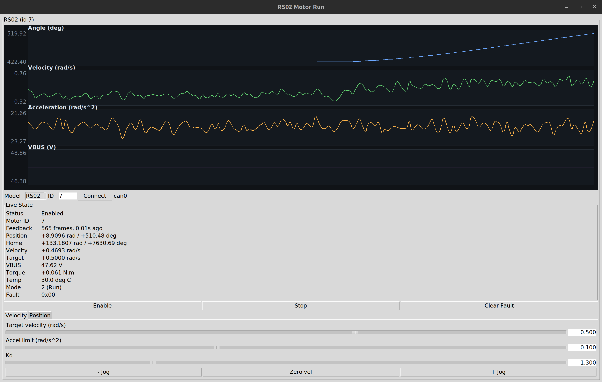
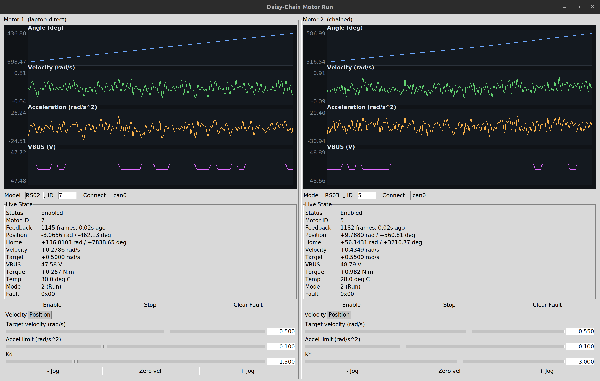

# motor_test

GUI motor control/plotting apps. Both use the private CAN protocol (velocity mode + position-hold mode) and share the same safety logic (accel ramp, overspeed auto-stop, Kp locked to 0 in Velocity mode).

## motor_run.py

Single-motor GUI.



```bash
python3 motor_run.py
```

Options:
- `--channel` -- CAN channel, default: can0
- `--interface` -- python-can interface, default: socketcan
- `--model {rs02,rs03}` -- initial motor model, default: rs03
- `--motor-id` -- initial motor CAN ID, default: 5
- `--host-id` -- host CAN ID, default: 0xFD

## daisy_chain_run.py

Two-motor GUI for a daisy-chained



```bash
python3 daisy_chain_run.py
```

Options:
- `--channel` -- CAN channel, default: can0
- `--interface` -- python-can interface, default: socketcan
- `--host-id` -- host CAN ID, default: 0xFD
- `--panel1-model {rs02,rs03}` -- panel 1 initial model, default: rs02
- `--panel1-id` -- panel 1 initial motor CAN ID, default: 7
- `--panel2-model {rs02,rs03}` -- panel 2 initial model, default: rs03
- `--panel2-id` -- panel 2 initial motor CAN ID, default: 5